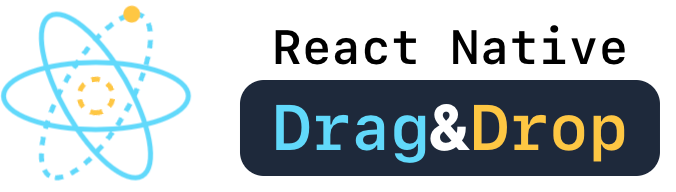
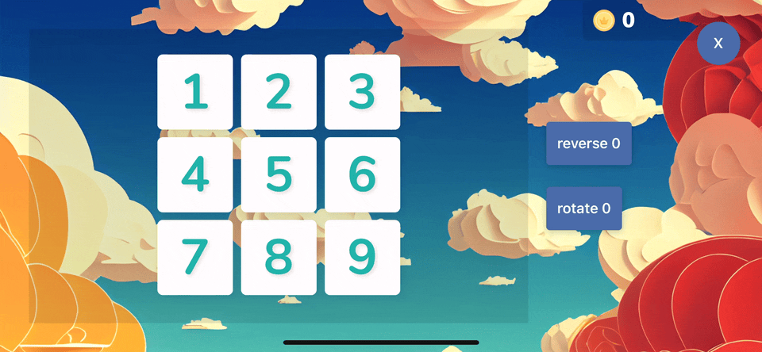

# React Native Drag and Drop

<!-- markdownlint-disable MD033 -->
<p align="center">
  <a href="https://www.npmjs.com/package/@mgcrea/react-native-dnd">
    
  </a>
  <a href="https://www.npmjs.com/package/@mgcrea/react-native-dnd">
    
  </a>
  <a href="https://www.npmjs.com/package/@mgcrea/react-native-dnd">
    
  </a>
  <a href="https://www.npmjs.com/package/@mgcrea/react-native-dnd">
    
  </a>
  <br />
  <a href="https://github.com/mgcrea/react-native-dnd/actions/workflows/main.yaml">
    
  </a>
  <a href="https://depfu.com/github/mgcrea/react-native-dnd">
    
  </a>
</p>

<p align="center" style="margin: 64px">
  <a href="https://mgcrea.github.io/react-native-dnd" style="display: block; max-width: 384px">
    
  </a>
</p>
<!-- markdownlint-enable MD037 -->

## Features

Modern and easy-to-use drag&drop library for react-native.

- **Modern and future-proof:** Built on [react-native-reanimated v3](https://github.com/software-mansion/react-native-reanimated/)

- **Ready to use:** Out-of-the-box configurable components like [`Draggable`](./src/components/Draggable.tsx) and [`Droppable`](./src/components/Droppable.tsx) to quickly get started.

- **Hooks based:** Exposes powerful hooks [`useDraggable`](./src/hooks/useDraggable.ts) and [`useDroppable`](./src/hooks/useDroppable.ts) to build your own primitive components.

- **Powerful & Performant:** The implementation has been tailored for advanced use cases where performance is critical. It can be used for a wide range of use cases like sorting.

## Demo



## Install

```bash
npm install @mgcrea/react-native-dnd --save
# or
yarn add @mgcrea/react-native-dnd
# or
pnpm add @mgcrea/react-native-dnd
```

### Dependencies

This package relies on :

- [react-native-reanimated@>=3](https://github.com/software-mansion/react-native-reanimated/)
- [react-native-gesture-handler@>=2](https://github.com/software-mansion/react-native-gesture-handler/)
- [react-native-haptic-feedback@>=2](https://github.com/mkuczera/react-native-haptic-feedback/)

You first need to add them as dependencies:

```bash
npm install react-native-reanimated react-native-gesture-handler react-native-haptic-feedback --save
# or
yarn add react-native-reanimated react-native-gesture-handler react-native-haptic-feedback
# or
pnpm add react-native-reanimated react-native-gesture-handler react-native-haptic-feedback
```

Then you must follow their respective installation instructions:

- [react-native-reanimated](https://docs.swmansion.com/react-native-reanimated/docs/fundamentals/installation)
- [react-native-gesture-handler](https://docs.swmansion.com/react-native-gesture-handler/docs/installation)

## Quickstart

```tsx
import { DndProvider, DndProviderProps, Draggable, Droppable } from "@mgcrea/react-native-dnd";
import type { FunctionComponent } from "react";
import { SafeAreaView, StyleSheet, Text } from "react-native";
import { GestureHandlerRootView, State } from "react-native-gesture-handler";

export const App: FunctionComponent = () => {
  const handleDragEnd: DndProviderProps["onDragEnd"] = ({ active, over }) => {
    "worklet";
    if (over) {
      console.log("onDragEnd", { active, over });
    }
  };

  const handleBegin: DndProviderProps["onBegin"] = () => {
    "worklet";
    console.log("onBegin");
  };

  const handleFinalize: DndProviderProps["onFinalize"] = ({ state }) => {
    "worklet";
    console.log("onFinalize");
    if (state !== State.FAILED) {
      console.log("onFinalize");
    }
  };

  return (
    <SafeAreaView>
      <GestureHandlerRootView>
        <DndProvider onBegin={handleBegin} onFinalize={handleFinalize} onDragEnd={handleDragEnd}>
          <Droppable id="drop" style={styles.box}>
            <Text>DROP</Text>
          </Droppable>
          <Draggable id="drag" style={styles.box}>
            <Text>DRAG</Text>
          </Draggable>
        </DndProvider>
      </GestureHandlerRootView>
    </SafeAreaView>
  );
};

const styles = StyleSheet.create({
  box: {
    margin: 24,
    padding: 24,
    height: 128,
    width: 128,
    justifyContent: "center",
    alignItems: "center",
    backgroundColor: "darkseagreen",
  },
});
```

## Credits

Inspired by:

- [clauderic/dnd-kit](https://github.com/clauderic/dnd-kit)

## Authors

- [Olivier Louvignes](https://github.com/mgcrea) <<olivier@mgcrea.io>>

## License

```txt
The MIT License

Copyright (c) 2023 Olivier Louvignes <olivier@mgcrea.io>

Permission is hereby granted, free of charge, to any person obtaining a copy
of this software and associated documentation files (the "Software"), to deal
in the Software without restriction, including without limitation the rights
to use, copy, modify, merge, publish, distribute, sublicense, and/or sell
copies of the Software, and to permit persons to whom the Software is
furnished to do so, subject to the following conditions:

The above copyright notice and this permission notice shall be included in
all copies or substantial portions of the Software.

THE SOFTWARE IS PROVIDED "AS IS", WITHOUT WARRANTY OF ANY KIND, EXPRESS OR
IMPLIED, INCLUDING BUT NOT LIMITED TO THE WARRANTIES OF MERCHANTABILITY,
FITNESS FOR A PARTICULAR PURPOSE AND NONINFRINGEMENT. IN NO EVENT SHALL THE
AUTHORS OR COPYRIGHT HOLDERS BE LIABLE FOR ANY CLAIM, DAMAGES OR OTHER
LIABILITY, WHETHER IN AN ACTION OF CONTRACT, TORT OR OTHERWISE, ARISING FROM,
OUT OF OR IN CONNECTION WITH THE SOFTWARE OR THE USE OR OTHER DEALINGS IN
THE SOFTWARE.
```
